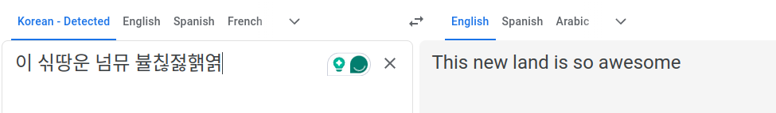
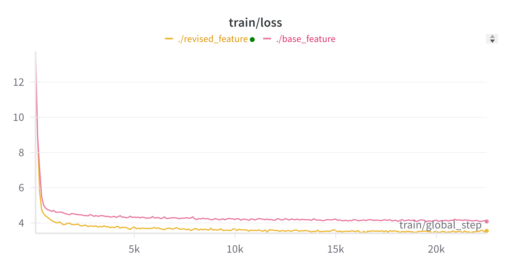
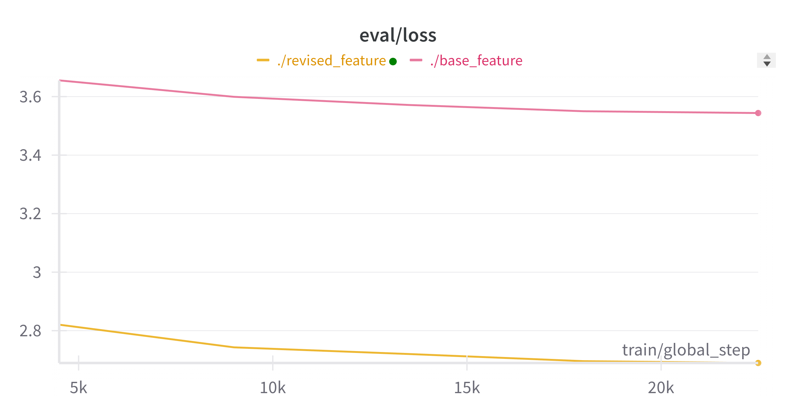
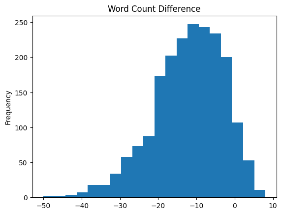
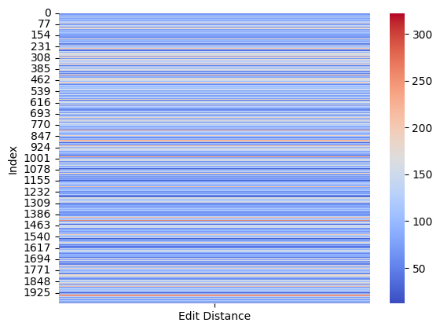

<table>
  <caption>
    Course Project Info
  </caption>
<tbody>
  <tr>
    <th>Code Repository URL</th>
    <td>https://github.com/uazhlt-ms-program/ling-582-fall-2024-course-project-code-nmt_finetune</td>
  </tr>
  <tr>
    <th>Demo URL (optional)</th>
    <td></td>
  </tr>
  <tr>
    <th>Team name</th>
    <td> nmt-finetune</td>
  </tr>
</tbody>
</table>

___


### Summary of the project 

As a native Korean speaker, Koreans have an unique ability in ciphering abnormal Korean texts into standard Korean. For the past few years, Koreans used various methods to write negative reviews on foreign websites, such as Airbnb and Google Map, to make hosts difficult to translate into their L1 language using Google Translator or other Machine Learning Translation tools. For example, if a Korean wants to write a bad review for a restaurant due to its awful services, they might writ the review as "이 싞땅운 넘뮤 뷸칞젏핽엵" (which in standard Korean would be "이 식당은 너무 불친절해요",meaning "this resaturant is very unfriendly"). This transformation of orthogrphy would make non-native speakers of Korean hard to interpret even they use the machine translation tools that are available on several websites. Here is an example of the result in the Google Translate website.

  


As shown in the above image, the machine translation shows totally different prediction, which indicates that this issue is still an unsolved area in computational field. Recently, OpenAI uploaded a video clip which uses OpenAI o1 model to cipher these corrupted Korean sentences (https://www.youtube.com/watch?v=eZDmDn6Iq9Y&ab_channel=OpenAI). It showed a quite successful results but it was not a tranlsation task but inferring what the standard Korean would be based on the corrupted sentence. 
Although the sentence written by the reviewer is not a standard Korean that we usually use in our daily life, most of Koreans would understand what the meaning of sentence is without any learning what the transformation rules are. Based on this interesting fact, the present project aims to investigate whether fine-tuning pre-trained language model (mT5) with transformation texts would improve its translation from Korean scrambled texts to English. If it could succeed, it would shed a light in translating low-resource language to English.
___
### Approach of the study
Two major steps were used in the current project. The first step is the creating synthetic dataset that will be used in the fine-tuning period of the pre-trained (mT5-base) model, and the Second step is fine-tuning pre-trained model with LoRA configuration.

#### Data Collection
To collect corrupted Korean texts with its English translation, the present project used Python package *Korpora*, which is a Korean Corpora Archives, for Korean-English parallel dataset. Among various corpus, the study used 20,000 tokens from Ko-En Parallel Corpus (https://ko-nlp.github.io/Korpora/en-docs/corpuslist/korean_parallel_koen_news.html).

After collecting the data, the study used Korean website(https://xeno.work/koenc.html#) which tranforms the standard texts into corrupted texts with Python package Selenium. There are numerous ways to make corrupted or uninterpretable Korean texts. In the website, there were 5 different methods to create corrupted texts in Korean. However, the present project only used a single method which is "add batchim" (meaning add characters at final consonants e.g., 사과 (apple/apology) -> 삵괋). The main reason for restricting the method of creating the uninterpretable text is to examine whether the large language model (LLM) could generalize this methods or not. After collecting both Korean-English parallel tokens and corrupted Korean texts, it was saved as a .csv file (`train_data_with_transformation.csv`) under the directory of `scripts/data_collection/revised`.

#### Fine-tuning mT5 model
Based on the dataset collected from webscrapping, the project designed a neural machine translation using pre-trained LLM (mT5-base). At the first approach, the raw Korean texts (uninterpretable) were used as a source text while English texts were used as a target text. However, it showed poor performance, and the model couldn't not learn any patterns from the raw uninterpretable Korean texts. 

To solve the problem, I tried it to decompose the raw texts into jamo. As Korean is an agglutinative language, decomposing each componenent of the orthography would help the model to learn the patterns and make improved translation. During this process, two methods were used: 1) uninterpretable texts that are decomposed to jamo 2) standard Korean text + uninterpretable texts that are decomposed to jamo. With the same training period, two different preprocessing methods will be compared with the base model which did not have fine-tune process.

- Training / Evaluation splits: 
  - Out of 20,000 tokens, 18,000 tokens were used in the training and evaluation process. From the 18,000 tokens, 1,800 tokens were used in the evaluation task, and 16,200 tokens were used in the training task. Evalution loss was calculated after each epoch during the training and it was stored in the wandB to check the process visually.
  - In addition to the usage of `TrainingArguments`, the current project utilized Low-Ranked Adapation of Large Langauge Model (LoRA) to reduce the number of training parameters. This makes training much faster, memory-efficient, and produces smaller model weight which are easier to store. Python library *peft* was used for `LoraConfig`.
  
```
Traing Arguments:
  - epoch = 5
  - learning_rate = 1e-4
  - batch size = 4
  - weight decay = 0.01
```

```
LoRA configuration parameters:
  - r (Lora attention dimension) = 16
  - lora_alpha (The alpha parameter for Lora scaling) = 32
  - target_modules (modules to apply the Lora update matrices): ['q', 'v'] (q for query, v for value)
  - lora_dropout (The dropout probability of Lora layers) = 0.1
  - task_type = 'CAUSAL_LM'
```
- Testing the model:
  - After training both `base` and `revised` models, the performance of both models were measured using CHRF (Character F-score) from *sacrebleu* library. This metric measures the quality of tranlsation by assessing character-level similarity between a predicted tranlsation and reference translation. The CHRF scores for both models were compared with the base mT5 model to examine the improvement of the model.

---
### Aspects of NLP
The synthetic data that I made based on the Korean-English parallel corpus could be regarded as low-resource language. As the pre-trained language model takes small amount of data (scrambbled or corrupted texts), the projects wants to reveal whether it can outperform current Machine Translation model or LLM.

In addition to the aspects of low-resource machine translation, the study used a text processing to decompose Korean orthography into *jamo*. Also, to improve the feature representation, the project combined standard Korean texts and decomposed corrupted texts. 

Lastly, the current project utilized fine-tuning pre-trained model with applying LoRA for effiecient model fine-tuning.


---
## Summary of individual contributions
<table>
  <thead>
  <tr>
    <th>Team member</th>
    <th>Role/contributions</th>
  </tr>
  </thead>
<tbody>
  <tr>
    <th><b>Ki Woong Moon</b></th>
    <td>Create dataset for fine-tuning & build a neural machine translation model (Kor(scrambled)-EN) with fine-tuning the pre-trained LLM (mT5)</td>
  </tr>
  
</tbody>
</table>


## Results

### results of training

|  Model              | training Loss   | evaluation (test) loss | training time (seconds)  | evaluation (test) time (seconds)|
|---------------------|-----------------|---------------------|------------------ |------------------------|
| Base Model          | 4.3715          | 3.5567              | 2034.5344         |16.7055                 |
| Revised Model       | 3.5117          | 2.6651              | 3536.8129         |28.2062                 |


  
  

### Comparsions between fine-tuned models and base (mT5) model
|  Model              | CHRF score      |Improved over Base model|
|---------------------|-----------------      |-------------------|
| Base Model          |       1.45  | 
| fine-tuned with base feature Model       |     10.15|+8.7
| fine-tuned with revised feature model | 16.84|+15.39


Compared to the base mT5 model, fine-tuning with the synthetic datset helped the performance of the model significantly. However, even with the fine-tuning method, the performance of the model was not promising. 

## Error analysis
At first of the testing phase, the base feature model (using only jamo of the transformed Korean texts) could not predict any of the texts in English.

Example

|Korean|Input(jamo)|English|results|
|------|-----------|--------|-------|
|2004년 총선의 투표율은 75%였다.|2004ㄴㅕㄵㅊㅗㅎㅅㅓㄵㅇㅢㄼ ㅌㅜㄼㅍㅛㄼㅇㅠㄾㅇㅡㄵ 75%ㅇㅕㅆㄷㅏㄼ.|That year, overall turnout was 75 percent.| <extra_id_0> 녅|

As the testing procedes, it started to provide some English text such as:

|Korean|Input(jamo)|English|results|
|------|-----------|--------|-------|
|그가 대통령직에서 물러난 이후에는 지병으로 공식 석상에 등장하지 못했다.|ㄱㅡㄼㄱㅏㄼ ㄷㅐㄼㅌㅗㅎㄹㅕㅎㅈㅣㄲㅇㅔㄼㅅㅓㄼ ㅁㅜㄾㄹㅓㄼㄴㅏㄵ ㅇㅣㄼㅎㅜㄼㅇㅔㄼㄴㅡㄵ ㅈㅣㄼㅂㅕㅎㅇㅡㄼㄹㅗㄼ ㄱㅗㅎㅅㅣㄲ ㅅㅓㄲㅅㅏㅎㅇㅔㄼ ㄷㅡㅎㅈㅏㅎㅎㅏㄼㅈㅣㄼ ㅁㅗㅆㅎㅐㅆㄷㅏㄼ.|Poor health kept him from court after he left office.|The former military officers took a military leave to a|

However, even at the last stage of the testing, the model couldn't predict informative English texts that are related to the reference texts.

However, for the revised feature model (Standard Korean + jamo of the Transformed Korean) showed improved results at the testing phase.

|Korean|Input(jamo)|English|results|
|------|-----------|--------|-------|
|리히터 규모 7.9의 이번 지진은 12일 학생들이 수업을 받고 있던 시간에 발생했다.       |    리히터 규모 7.9의 이번 지진은 12일 학생들이 수업을 받고 있던 시간에 발생했다. [SEP] ㄹㅣㄼㅎㅣㄼㅌㅓㄼ ㄱㅠㄼㅁㅗㄼ 7.9ㅇㅢㄼ ㅇㅣㄼㅂㅓㄵ ㅈㅣㄼㅈㅣㄵㅇㅡㄵ 12ㅇㅣㄾ ㅎㅏㄲㅅㅐㅎㄷㅡㄾㅇㅣㄼ ㅅㅜㄼㅇㅓㅄㅇㅡㄾ ㅂㅏㄷㄱㅗㄼ ㅇㅣㅆㄷㅓㄵ ㅅㅣㄼㄱㅏㄵㅇㅔㄼ ㅂㅏㄾㅅㅐㅎㅎㅐㅆㄷㅏㄼ.       |  The 7.9-magnitude earthquake hit Monday afternoon, when thousands of children were in class.     | The explosion was a shock of 7.9 a Richter scale.      |

By adding the standard Korean texts, the model could translate the input texts much better than the base feature model. Although the model showed slightly better performance than using the model that only used the jamo sequence of the corrupted text, it still maintained low performance in terms of CHRF score. To generalize the error of the model, error analysis was conducted.

To check whether the model could translate Korean corrupted texts to English correclty, average word count was calculated in the test data.

| | Reference text| Prediction|
|--|--------------|------------|
Average Word count | 23.79| 11.64|

Based on the average word count, the prediction showed significantly lower word count indicating that huge omissions occurred during the translation.

  


After analyzing the average word count for each token, the project computed the Levenshtein edit distance using `nltk` library between predictions and references. This indicates the number of insertions, deletions or substtitutions required to convert one string into another.
The average edit distance was 110.26 which is a high edit distance. This indicates that the model's predictions are quite different from the reference translations, suggesting that the model is generating a lot of incorrect words, has significant omissions or additions in the predictions, and consequently failed to align with the reference text both semantically and syntactically.

  


## Reproducibility
ReadMe files were created at https://github.com/uazhlt-ms-program/ling-582-fall-2024-course-project-code-nmt_finetune for requirements and settings. 

Comments were provided in the source code for reproduction.


## Future improvements
Although fine-tuning the LLM with Koren corrupted texts showed significant improvement compared to the naive base model, there are still more ways to improve the performance of the model significantly.
1. Expanding Training datset 
  - 16,200 tokens used during the training couldn't make the model perfectly generalize the pattern of corrupted text used in the proejct. Increasing the training data would improve the model's performance. Larger dataset typically results better performance, especially for low-resource machine tranlsation.
2. Improving Tokenization
  - The current project did not used Korean specific tokenizer. The reason for using multilingual tokenizer was to see whether the pre-trained tokenizer could generate plausible translation even with a new form of a text. Although it was written in Korean, the tokenizer might have difficulty in dealing with decomposed Korean texts (jamo). Using specific tokenizer such as MeCab-ko, Kkma may improve the performance of the model compared to mT5 tokenizer.
3. Provide a rule book for constructing corrupted texts or customized vocabulary.
- A well-defined rulebook for generating corrupted texts ensures consistency in the data used for training and evaluation. It can also aid in systematically exploring model performance under various corruption patterns. 
- Based on the rule book, creating a customized vocabulary with special tokens for corrupted text will improve the model's performance.

